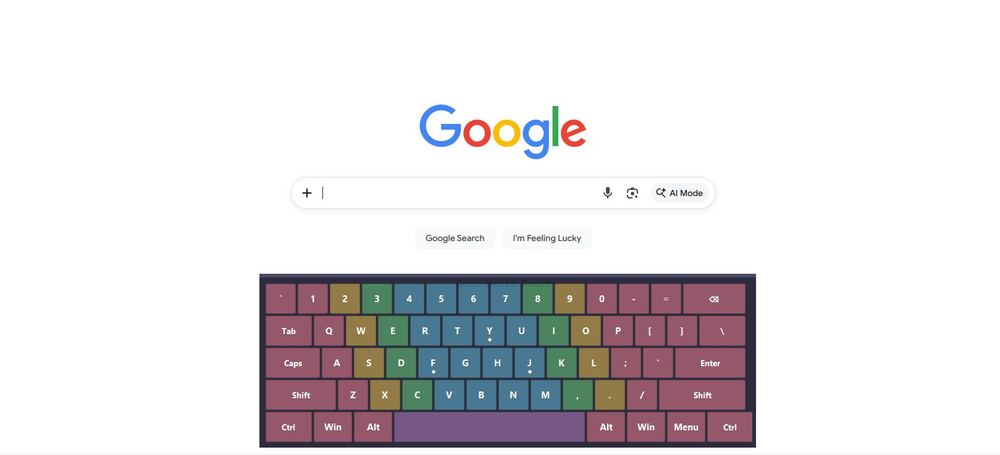

# Keyboard Overlay

Are you also only now learning how to touch type? Are you embarrassingly stuck with looking down at your keyboard while you type?

Look no further!

After becoming so old that I'm realizing I'm getting chronic shoulder and neck pain from shrimping over my keyboard, I realized it was time to do something about my shitty typing habits. As a result, I attempted to learn touch typing on [keybr.com](https://www.keybr.com/). While it was super helpful (shoutout to them!), I also realized that when I did not have the visual keyboard on screen, I still habitually looked down at my keyboard.

In order to fix that, I created this simple keyboard overlay.

It's a lightweight, always-on-top keyboard overlay for Windows that shows which keys you're pressing in real time - color-coded by finger zone to help you hit the correct buttons. Inspired by [keybr.com](https://www.keybr.com/).

> **Note:** This uses an **English (US) QWERTY** keyboard layout.



---

## Features

- **Always on top** - stays visible above all windows. No clicking needed, unlike the accessibility keyboard in Windows options, for example.
- **Global key capture** - detects your keystrokes even when other apps are focused.
- **Finger-zone coloring** - each key is permanently tinted by which finger should press it: pinky, ring, middle, index, and thumb.
- **Press feedback** - keys go dark when pressed for visual confirmation.
- **Homing dots** - small dots on F, J, and Y so you can easily find home position.
- **Frameless and draggable** - clean overlay look, slightly translucent, can be dragged anywhere on screen.
- **Lightweight** - pure Python + tkinter, no Electron, no browser, ~370 lines.
- **Customizable** - colors, opacity, font, and key size are all constants at the top of the file. Current size is mirrored after a standard keyboard.

## Finger-Zone Color Map

| Color | Finger |
|-------|--------|
| Rose | Pinky |
| Amber | Ring |
| Green | Middle |
| Blue | Index |
| Purple | Thumb |

---

## Requirements

- **Windows 10/11**
- **Python 3.7+** - [Download from python.org](https://www.python.org/downloads/)
  - During installation, check **"Add Python to PATH"** 
- **pynput** - installed automatically by the launcher script

## Installation

### Option A: One-click launcher (easiest)

1. Download or clone this repo
2. Double-click **`run_overlay.bat`**
3. That's it - it installs `pynput` if needed and launches the overlay

### Option B: Manual

```bash
# Clone the repo
git clone https://github.com/vivithekiwi/keyboard-overlay.git
cd keyboard-overlay

# Install dependency
pip install -r requirements.txt

# Run
python keyboard_overlay.py
```

---

## Usage

| Action | How |
|--------|-----|
| **Move the overlay** | Click and drag anywhere on the keyboard or the thin bar at the top |
| **Quit** | Right-click anywhere on the overlay |

Customize all specs to your liking by changing the constants at the top of `keyboard_overlay.py`:

```python
BG_COLOR        = "#1a1a2e"       # Dark background
KEY_PRESSED     = "#1e1e36"       # Pressed key fill (dark)
TEXT_DEFAULT     = "#ffffff"       # Label color
OVERLAY_ALPHA   = 0.92            # Window opacity (0.0-1.0)
FONT_FAMILY     = "Segoe UI"
FONT_SIZE       = 11

ZONE_COLORS = {
    "pinky_l":  "#8c4a5e",        # Change any color here
    "ring_l":   "#8a7038",
    ...
}

DOT_KEYS = {"f", "j", "y"}       # Add/remove homing dots
```

---

## Troubleshooting

**"Python not found" when running the .bat file**
You need to install Python and make sure "Add Python to PATH" was checked during install. If you already installed Python without that checkbox, uninstall and reinstall it with the checkbox ticked.

**The overlay doesn't capture keystrokes**
This might be antivirus software blocking global keyboard hooks. Try adding `keyboard_overlay.py` to your antivirus exceptions list.

**Keys get stuck highlighted**
There's a 120ms auto-release safety net built in. If keys still stick, increase `PRESS_DURATION` in the config.

**I want to use this on macOS/Linux**
It should mostly work since tkinter and pynput are cross-platform, but honestly, I haven't tested it outside of my Windows 10 desktop. The `overrideredirect` and `-topmost` behavior may differ. Please let me know how it goes!

---

## Contributing

See [contributing.md](contributing) for guidelines.

## License

[MIT](LICENSE) - do whatever you want with it.

## Acknowledgments

- Inspired by the keyboard visualization on [keybr.com](https://www.keybr.com/). Shoutout to them for providing such an awesome free resource!
- Built with [pynput](https://github.com/moses-palmer/pynput) for global key capture.
